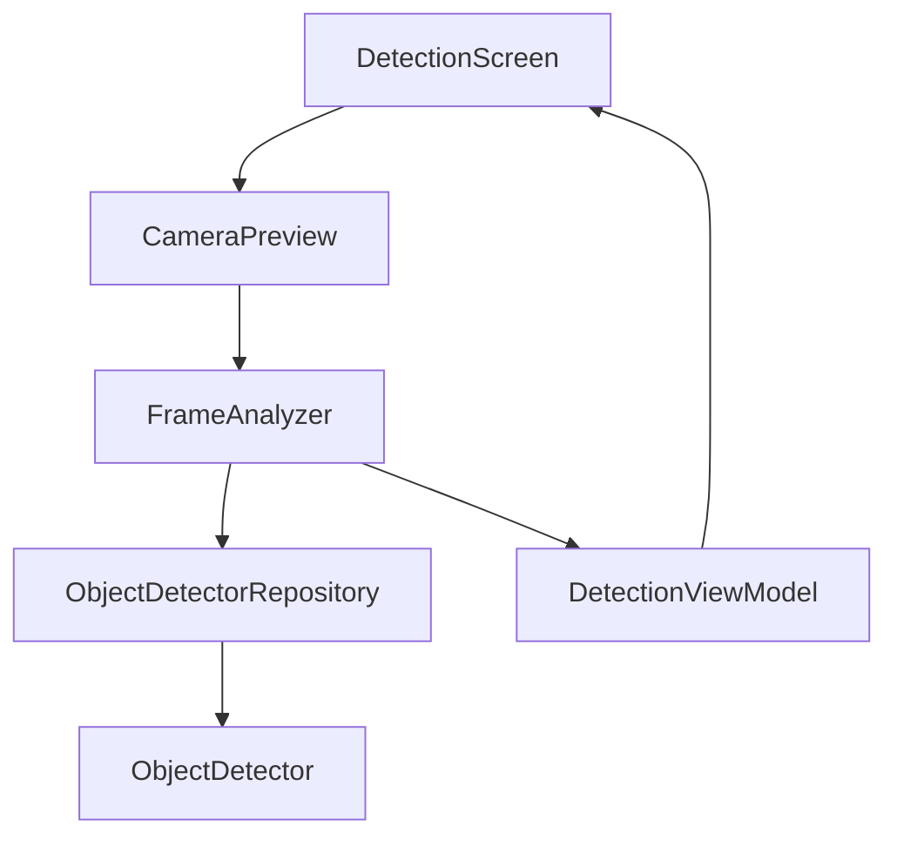

# Meerkat

Small Android app for learning Google ML Kit. Point the camera at something and it draws a box around whatever it recognizes, tracking each object across frames as you move around.

## Architecture

MVVM, Hilt for DI, coroutines + StateFlow for state.

The screen just renders whatever `DetectionUiState` the ViewModel gives it, nothing else. The ViewModel doesn't know about CameraX or ML Kit at all, it just gets a list of detections back and pushes them into a StateFlow. All the camera and ML Kit specific code stays in `FrameAnalyzer` and `ObjectDetectorRepository`.

## How a frame gets processed

1. CameraX hands `FrameAnalyzer` an `ImageProxy`
2. wrap it in an `InputImage`, passing the rotation degrees along (skip this and boxes end up sideways)
3. `ObjectDetector.process()` runs on-device and returns a list of `DetectedObject`
4. that list gets pushed into the ViewModel's state
5. Compose scales the boxes to the preview size and draws them

Only one frame gets processed at a time. If a new frame shows up while the last one is still being analyzed, it just gets dropped instead of queued, otherwise frames pile up faster than the detector can keep up.

## ML Kit notes

- runs in `STREAM_MODE` since it's video and not single shots, this is also the only mode that gives you tracking ids
- `enableMultipleObjects()` so it's not just grabbing the biggest thing in frame
- `enableClassification()` gives a rough category per object (home good, food, plant, etc) with a confidence score. it's not real object recognition, more like "is this furniture or food"
- `process()` returns a Play Services `Task`, not a suspend function, so there's a small wrapper in `ObjectDetectorRepository` that bridges it into a coroutine

## Stack

Kotlin, Jetpack Compose, CameraX, ML Kit Object Detection, Hilt
